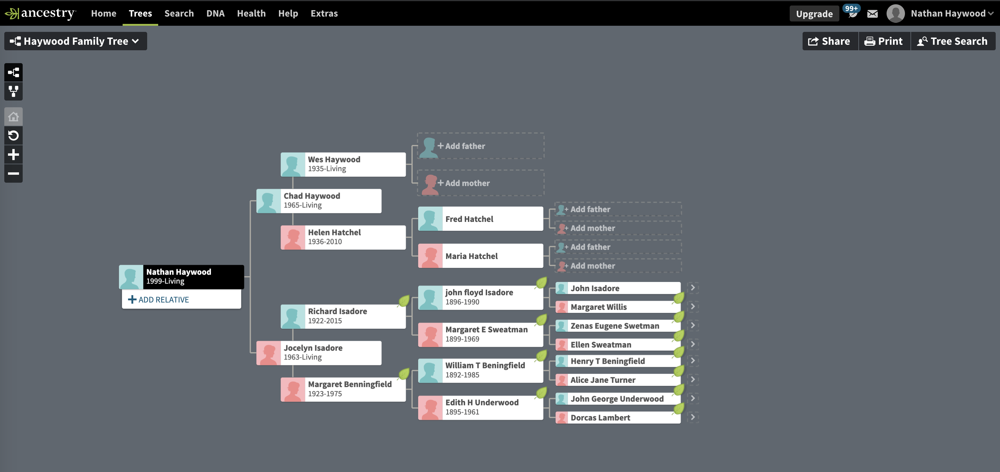

```{r setup, include=FALSE}
knitr::opts_chunk$set(echo = TRUE)
```

## Not a lot is known about my Dad's side of the family, nor are there many official records that I've found to suggest any other previous relations.
```{r pressure, echo=FALSE, fig.cap="Haywood Family Partial Tree", out.width = '100%'}

```